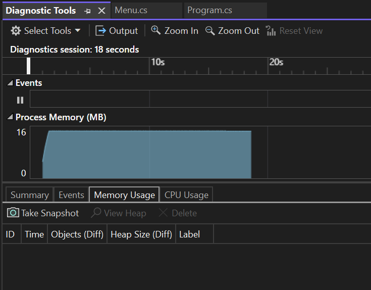
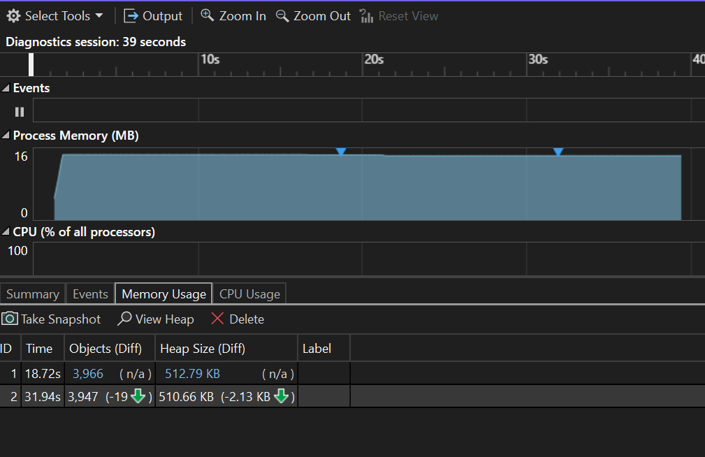
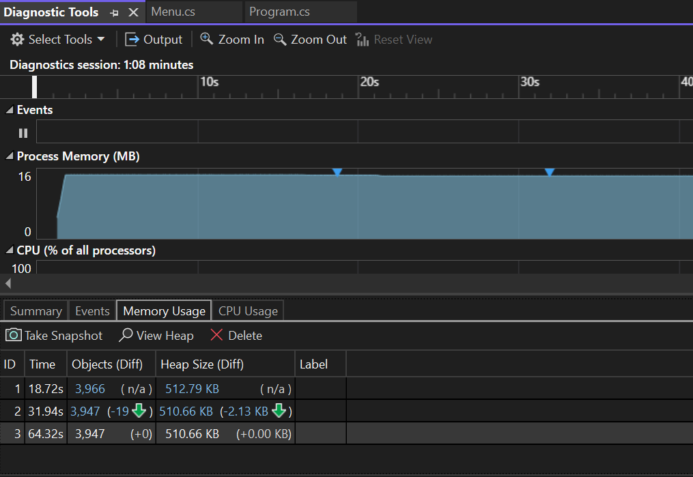
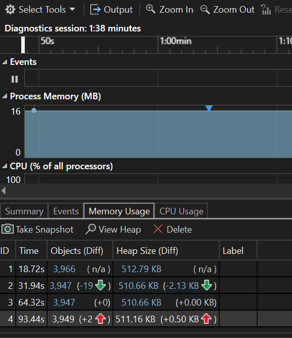
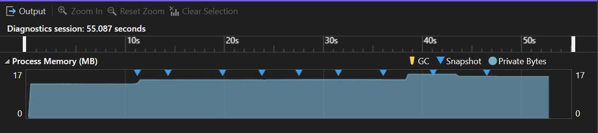

# **Memory Management**

 

## Introduction

This assignment is about the memory organization and how it works. And what are the memories avaliable and how it is organized and how to manage the memory with high efficiency.

 

## Value Type

 

A data type is a value type, if it holds the data within its own memory allocation. Value types include the following:

 

- All numeric data types (int, float, etc,.)

- Boolean

- Char

- Date

- All structures (even if their members are reference types)

 

If the value type is passed to a method then the value is copied to another memory and the changes in the method variable will not affect the main variable. The main variable and the method variable (which is passed as a parameter) both having different memory and it will not affect each other. This type of behaviour is called as Value type.

 

It value is stored in the stack, once the scope of the variable is came to an end then automatically the value (occupied memory) is destroyed.

 

## Reference Type

 

Unlike value types, a reference type doesn't store its value directly. Instead, it stores the address where the value is being stored. In other words, a reference type contains a pointer to another memory location that holds the data. Example of Reference type are :

- Class object

- Array object

- List

 

If the reference type is passed to a method then the address is copied to another memory and the changes in the method variable will affect the main variable. The main variable and the method variable (which is passed as a parameter) both having different memory but pointing to same memory and it will affect each other. This type of behaviour is called as Reference type.

 

It's value is stored in the Heap, once the scope of the variable is come to an end then the reference variable is destroyed but the value (which is stored in the Heap) is not destroyed. It is destroyed by the Garbage collection.

When entered into stack 

When exited from stack

When entered into heap 

When exited from heap

## Garbage Collection

 

The garbage collector is responsible for managing memory and automatically freeing up memory that is no longer being used by the application. The garbage collector works by periodically scanning the application’s memory to determine which objects are still being used and which are no longer needed. Objects that are no longer being used are marked for garbage collection, and their memory is freed up automatically by the garbage collector. We can also call the Garbage collector to collect the unused memory. by a command "GC.collect()".

 

## IDisposable

 

Types that use unmanaged resources implement the IDisposable or IAsyncDisposable interface to allow the unmanaged resources to be reclaimed. When you finish using an object that implements IDisposable, you call the object's Dispose or DisposeAsync implementation to explicitly perform cleanup. By just extend any class as the child class of "IDisposable" and add a Dispose method is more than enough to use IDisposable. THe Dispose method will automatically calls by itself when we use using concept to use the object of the class.

 

## Conclusion

 

From this assignment, I learned a lot about memory. I learned how memory will seperate the values, and store in both stack memory and Heap memory. I also learned about the Garbage collection. what is meant by three generations how it allocates the memory and how it act as high effiency. And at last I learned how to use IDisposable and how to organize the memory in effective manner.