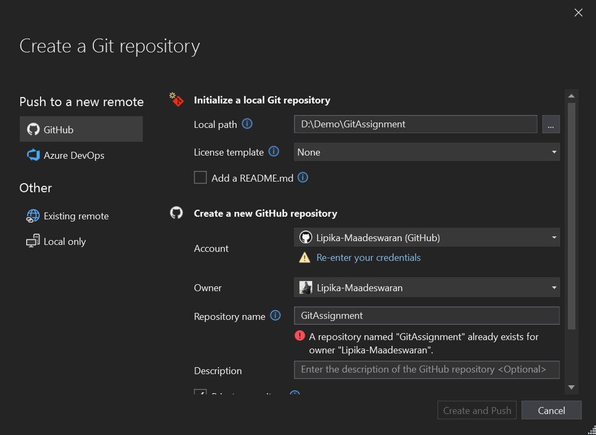
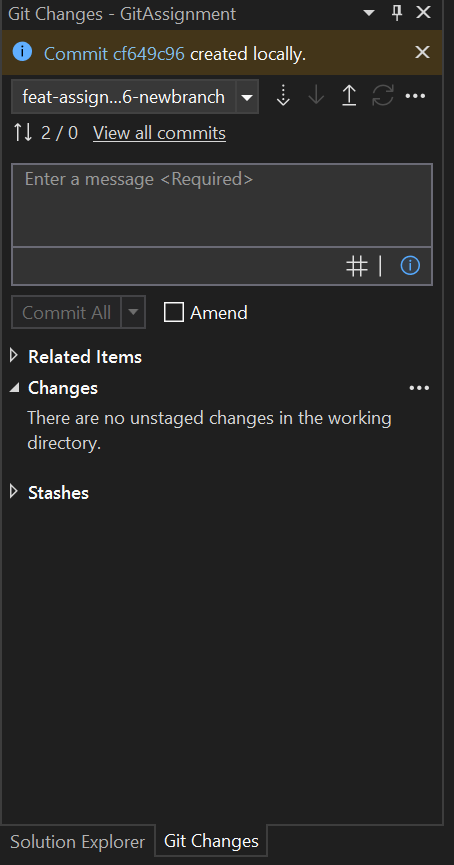
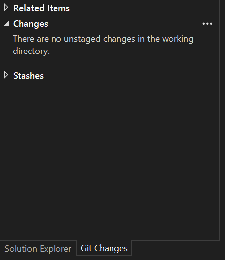
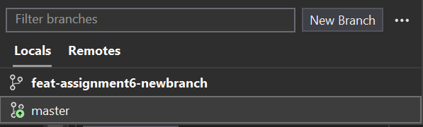
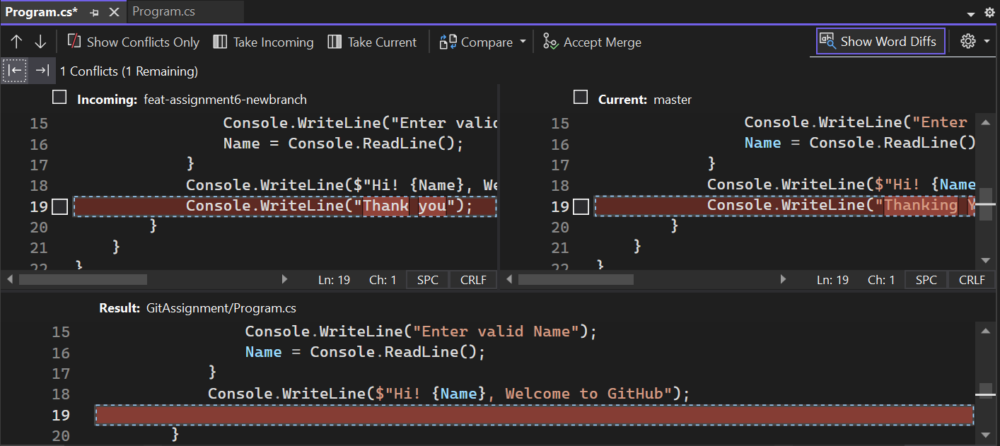
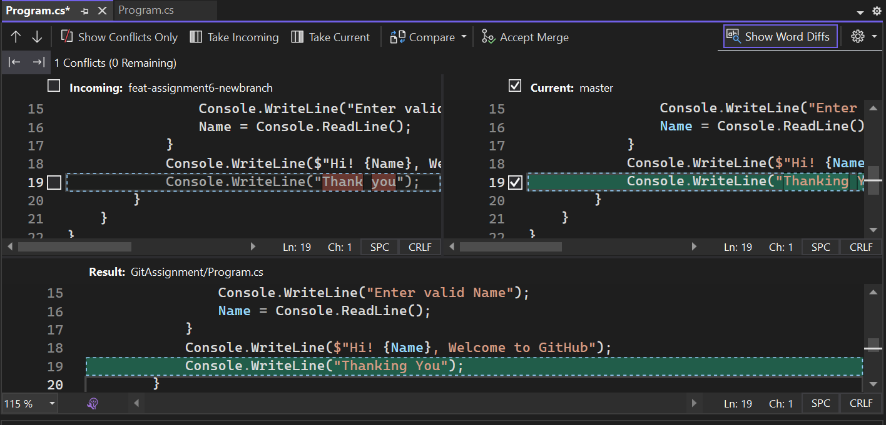
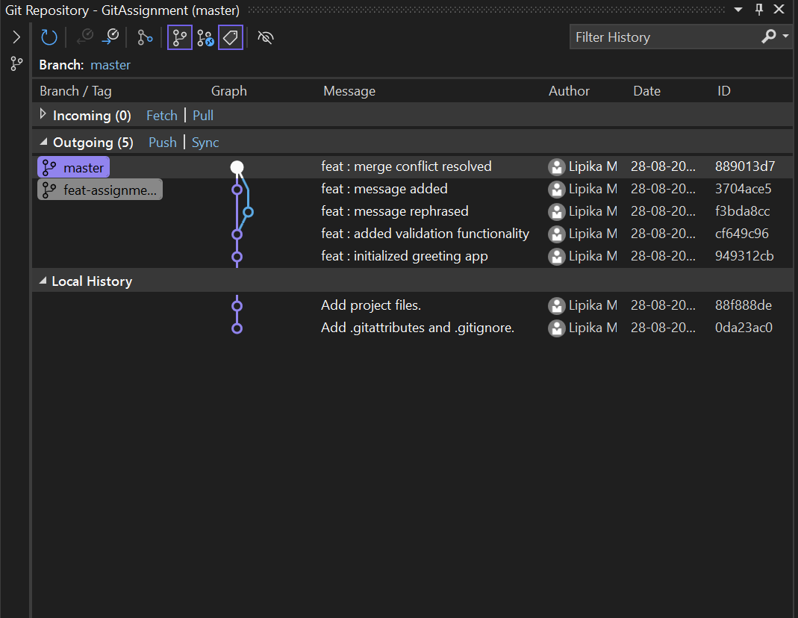
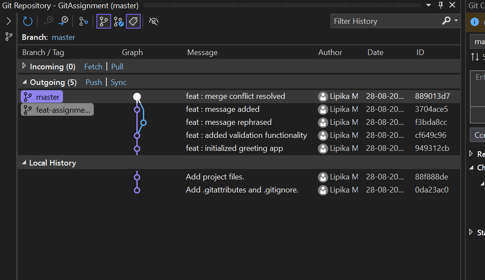
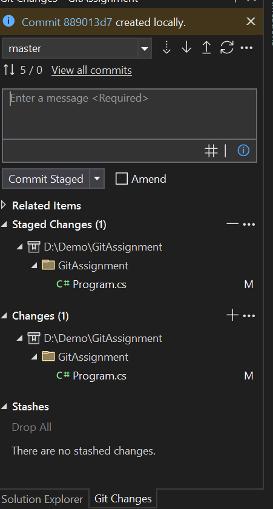
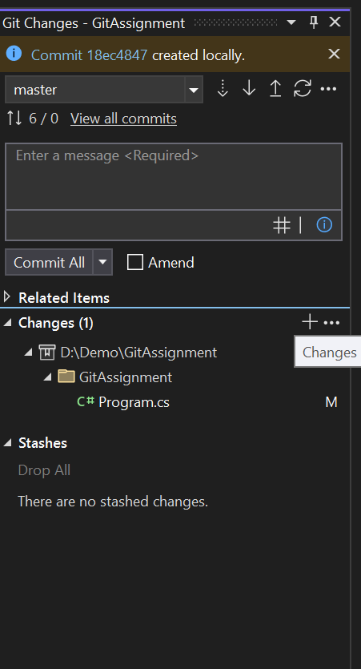

# SIMPLE PROJECT WITH GIT IN VISUAL STUDIO

## GitHub repository link for the assignment 
https://github.com/Lipika-Maadeswaran/GitAssignment.git
 

### TASK 1 : SETTING UP ENVIRONMENT

- Successfully installed Git and Visual Studio.

- Created a new console-based application project to work on.

 

### TASK 2 : INITIALIZING GIT REPOSITORY

 

- Established a new local Git repository.

- Pushed the local repository to GitHub.

 

    

 

- Inital commit has been made using Git changes window.

   

    

 

### TASK 3 : MAKING AND STAGING CHANGES

 

- Implemented user input validation feature.

- Staged all modifications using the Git Changes window.

 

    

 

### TASK 4 : COMMIT CHANGES

 

- Commit has been created locally using Git Changes window with a meaningful commit message.

  

    

  

 

### TASK 5 : BRANCHING AND MERGING

 

- New Branch has been created and checked out of master branch.

 

    

 

- Created a commit for modifications made in new branch.

- Pushed the local repository to GitHub.

 

 

- Created a PR with `base:main` and `compare : feat-assignment6-newbranch` and merged with main branch.

 

### TASK 6 : RESOLVING MERGE CONFLICT

 

- Added a Thankyou message and created a commit in the master branch.

- Checked out of `main branch` to `feat-assignment6-newbranch`.

- Modified the same line of the code and created a commit in this branch.

- Requested merge using Git changes Window.- This created a merge conflict.

   

    

 

- Resolved merge conflict by comparing the changes.

 

    

    

    

 

### TASK 7 : VIEWING GIT HISTORY

 

- We can view all the changes made in the visual studio using git.

 

- We can also view changes made in individual commit by clicking on the commit.

 

    

 

### TASK 8 : SELECTIVE STAGING

 

- In the git changes window there is an option to make selective staging.

    

    

    

- The stages have be completed

    

    
### CONCLUSION

Through this assignment, I have equiped with practical experiance in utilizing GitHub's features for effective version control and repositry management. By completing these tasks, it enhances the understanding of github mechanics. 
