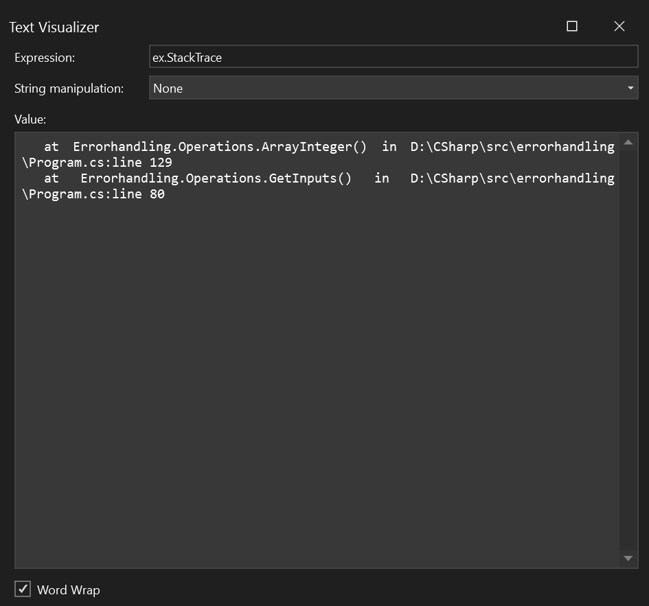

<style> .main { font-size: 18px; text-align: justify; } </style>

<div class="main"> 

## Introduction:

In C#, error handling is a crucial aspect of programming. It is used to manage and respond to errors that occur during the execution of a program. This assignment covers the concept of error handling in C# and how to implement it using various strategies such as try/catch/finally blocks, exceptions, custom exception classes, and global unhandled exception handling. 

## Task 1: Understanding and Using try/catch/finally blocks

Implementing a try/catch/finally block to handle any DivideByZeroException that might occur, In try block the inputs are inputted when an exception is thrown on dividing the numbers by 0, then the catch block would catch the exception thrown from the try block and process the exception. Now after the try catch block been executed, the finally block executes after the try and catch block.

```csharp
try{
//try block 
}
catch(Exception ex){
//catch block that catches the exception
}
finally{
//executes after the process of try and catch block
}
```

**Outcome:** The program correctly handled the DivideByZeroException and prints the appropriate messages.

## Task 2: Catching and Throwing Different Types of Exceptions

Implementing a try/catch block to handle any IndexOutOfRangeException. A for loop is created with large number of array count, when the input is read from the user, if the input received has index that is out of range, then the exception is thrown, The catch block catches the exception and processess the exception that has been thrown from the try block. Here the exception thrown is a different sort of exception named `IndexOutOfRangeException`. After processing the try and catch block the finally block executes.

```csharp
try{
//try block 
}
catch(IndexOutOfRangeException){
//catch block that catches the exception
}
finally{
//executes after the process of try and catch block
}
```

## Task 3: Defining and Using Custom Exception Classes

In task 2, when the input is read from the user, if the inputted value is not the excepted input value, for instance, when the program accepts only integer value, but the user enters a string or any special characters the validation fails, this throws a error, here the custom exception is created for this instance named as InvalidUserInputException.

## Task 4: Handling Global Unhandled Exceptions

When any unhandled exception occurs the global unhandled exceptions are executed

```csharp 
public static void Main(string[] args)
{
    AppDomain.CurrentDomain.UnhandledException += new UnhandledExceptionEventHandler(Eventhandler);
    Operations.GetInputs();
}

private static void Eventhandler(object sender, UnhandledExceptionEventArgs e)
{
    Console.WriteLine("Unhandled exceptions");
}
```

## Task 5: Using and global exception handler console application

For the exception thrown the stack trace is :



</div>
