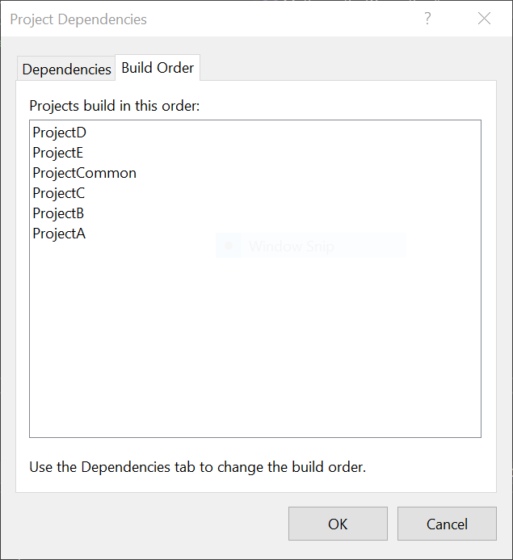
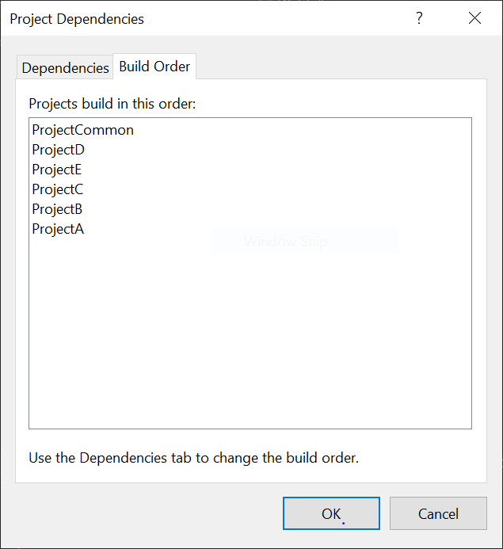

# **Project, Solution and Build Order**

 

## Introduction

    This assignments consist of six different projects but connected to each other. First project is "GreetingApp"(ProjectA) which has the dependency of the another project called "MathApp"(ProjectB), it also has a dependency of another project called "DisplayApp"(ProjectC). It has the dependency of another project which is the base of all the projects created named "UtilityApp"(ProjectD). And there are one more project to avoid the circular dependency, the name of that project is "ProjectCommon". And at last there is another project to do some basic task which is in the new project called "ProjectE".

 

## GreetingApp(ProjectA)

    In this project, it would ask for the name and just display a greeting with the name that is entered and  also it would call the "MathApp"(ProjectB) project which was add in the dependency of this project. it also uses a method from the "UtilityApp" project to get a vaild input.

 

## MathApp(ProjectB)

    In this project, the "MathApp" project which was added in the dependency of the current project. it also have the dependency of "ProjectCommon". Because to avoid circular dependency a new project is created and which is used in dependency for both the projects "MathApp" and "DisplayApp". It also call the DisplayApp project at the end of the project.

 

## DisplayApp

    In this project, the user will be prompted to select an operation by providing their choice for "what operation do you want to perform?" The program will then gather two integer inputs from the user and execute the chosen operation. The outcome of the computation will be displayed as the result of the process. To carry out the mathematical operation, the project will make use of the "ProjectCommon" which is included as a dependency in this project. Additionally, a method from the "UtilityApp" project will be utilized to ensure valid input from the user. Finally, the project will interface with the "ProjectE" project as well.

 

## ProjectE

    This is a transient project designed to perform a minor task involving a provided string. During runtime, the project receives a string input from the user. The project relies on the "UtilityApp" for its functionality and has added it as a dependency.

 

## UtilityApp

     It contains two methods, "display" which is used to get a vaild input from the user if the input is not valid then it will ask another vaild input from the user. 
 

## Circular Dependency

    While trying to call the mathametical operation method (which is used in the MathApp project) in "GreetingApp" project. It will show some pop-up with the information of using circular dependency. And to avoid that I created a new project named "ProjectCommon" and I moved all the needed methods to the ProjectCommon and I make the ProjectCommon project as the dependency of both the projects MathApp(ProjectB) and DisplayApp(ProjectC). So, now i could use the same method in both the projects and it will also avoid the circular dependacy.

 

### Before build order change

### After build order changed

