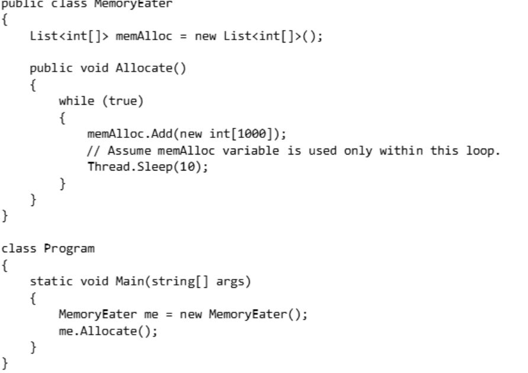
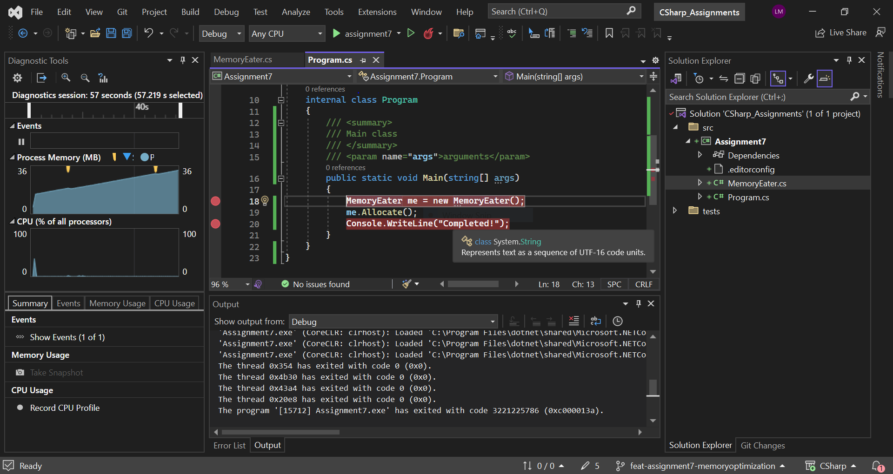
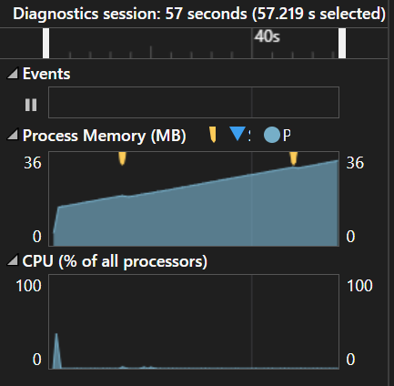
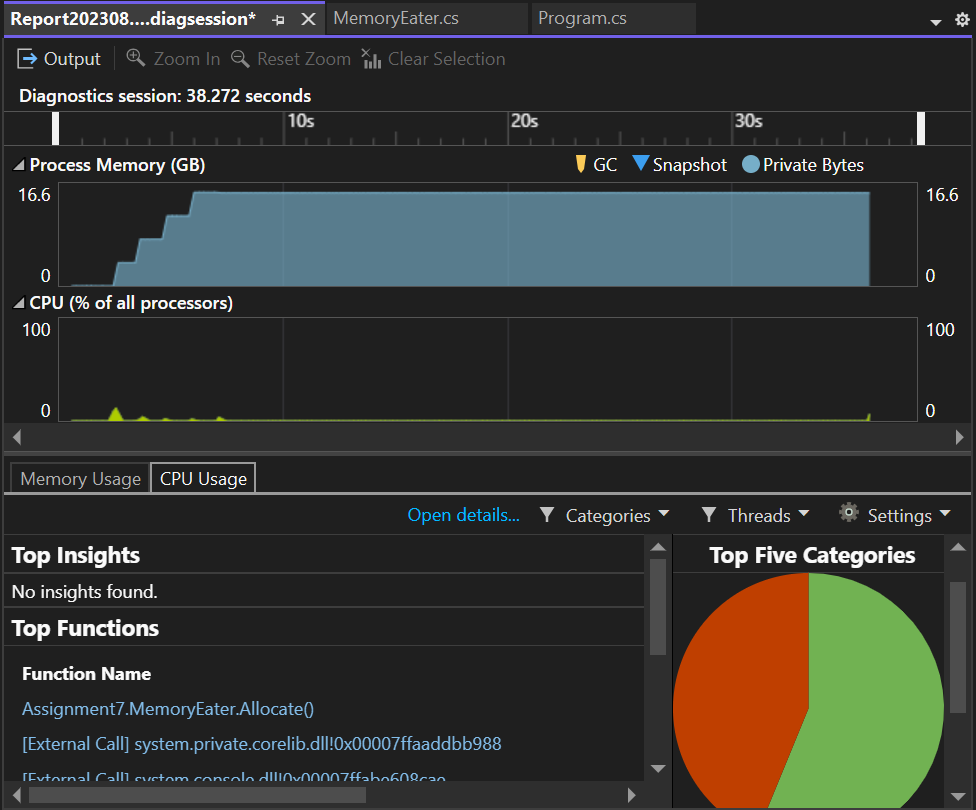
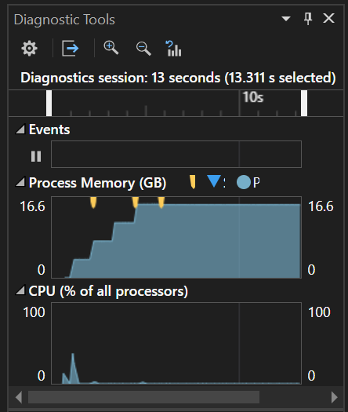

# ASSIGNMENT 7

## Memory Optimization in C#

In this assignment,  Exploration of memory management is completed, a critical aspect of any high-performance application. Detecting, diagnosing, and resolving memory issues in a C# codebase. Understanding the usage tools for memory profiling. 

## Detecting and Diagnosing Memory Issues

### **Objective:** To identify and diagnose memory issues



    On Analysing the given code snippet, we could identify the memory Leak


## **The memory leak screenshot is attached below:-**


### Memory Profiler Tool

    The Memory Profiler tracks allocations/deallocations of objects in native code for a specific time period and provides the following information: Allocations: A count of objects allocated via malloc() or the new operator during the selected time period.
    
### - Using a memory profiler tool to diagnose the problem in the code.
 ## Using Diagnostic tools
 ### The memory leak is captured and diagnosed using diagnostic tools

 ```csharp
// <copyright file="Program.cs" company="PlaceholderCompany">
// Copyright (c) PlaceholderCompany. All rights reserved.
// </copyright>

namespace Assignment7
{
    /// <summary>
    /// Program class
    /// </summary>
    internal class Program
    {
        /// <summary>
        /// Main class
        /// </summary>
        /// <param name="args">arguments</param>
        public static void Main(string[] args)
        {
            MemoryEater me = new MemoryEater();
            me.Allocate();
            Console.WriteLine("Completed!");
            Console.ReadKey();
        }
    }
}
```

```csharp
// <copyright file="MemoryEater.cs" company="PlaceholderCompany">
// Copyright (c) PlaceholderCompany. All rights reserved.
// </copyright>

namespace Assignment7
{
    /// <summary>
    /// MemoreEater class is iniatiated
    /// </summary>
    public class MemoryEater
    {
#pragma warning disable SX1309 // Field names should begin with underscore
        private List<int[]> memAlloc = new List<int[]>();
#pragma warning restore SX1309 // Field names should begin with underscore
        /// <summary>
        /// Allocate method is iniatiated
        /// </summary>
        public void Allocate()
        {
            try
            {
                while (true)
                {
                    this.memAlloc.Add(new int[1000000000]);
                    Thread.Sleep(1000);
                    Console.WriteLine("File added!");
                }
            }
            catch (Exception ex)
            {
                Console.WriteLine(ex.Message);
            }
            finally 
            {
                Console.WriteLine("Due to memory leak, we have to delete the first 2 task, Enter Y is proceed and N to exit");
                string? value = Console.ReadLine();
                if (value == "Y" || value == "y")
                {
                    for (int i = 0; i < 2; i++)
                    {
                        this.memAlloc.RemoveAt(0);
                    }
                }
                else if (value == "N" || value == "n")
                {
                    Environment.Exit(0);
                }
            }
        }
    }
}
```





